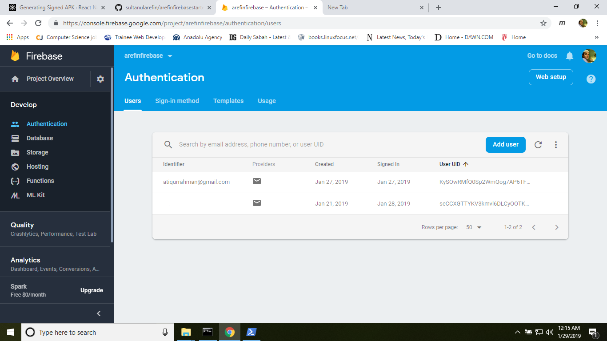
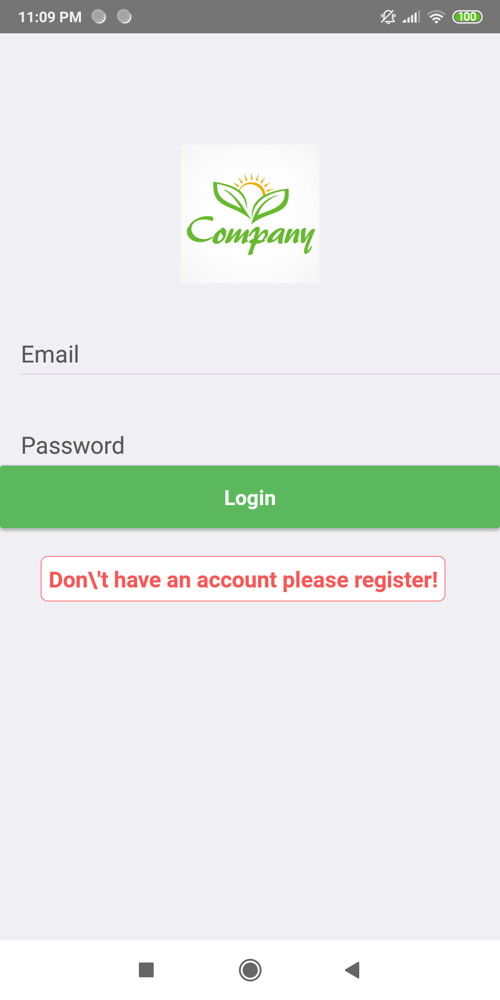

# please check this link
## https://github.com/sultanularefin/RN-Firebase-quick-bread

# Produced with these packages:
    "dependencies": {
    "@babel/polyfill": "^7.0.0",
    "@babel/runtime": "7.2.0",
    "docdash": "^0.4.0",
    "moment": "^2.23.0",
    "native-base": "2.7.0",
    "prop-types": "^15.6.2",
    "react": "^16.5.0",
    "react-native": "^0.57.8",
    "react-native-elements": "^1.0.0-beta7",
    "react-native-extra-dimensions-android": "^1.0.0",
    "react-native-firebase": "^5.2.0",
    "react-native-keyboard-aware-scroll-view": "^0.8.0",
    "react-native-snackbar": "^0.5.3",
    "react-native-vector-icons": "^6.1.0",
    "react-navigation": "^1.0.0"
  },

This project is tentative. 
### package.json added

# Screenshots:

## Credentials: 
	email: atiqurrahman@gmail.com 
	password: 12341234

Thanks!

-Md. Sultanul Arefin
